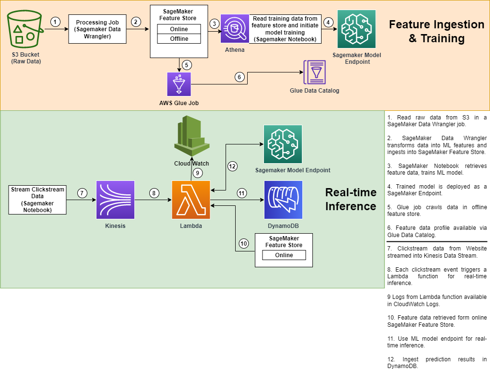

# End-to-end ML workflow to highlight SageMaker Feature Store

This repository demonstrates an end-to-end ML workflow using various AWS services such as SageMaker (FeatureStore, Endpoints), Kinesis Data Streams, Lambda and DynamoDB.

The dataset used here is [Expedia hotel recommendations dataset from Kaggle](https://www.kaggle.com/competitions/expedia-hotel-recommendations/data) and the use-case is predicting a hotel cluster based on user inputs and destination features. We ingest the raw data from an S3 bucket into a Amazon SageMaker FeatureStore and then read data from the FeatureStore to train ML model for predicting a hotel cluster. The trained model is deployed as a SageMaker endpoint. A simulated inference pipeline is created using Amazon Kinesis Data Streams and Lambda. Test data is put on the stream and this triggers a Lambda function which joins the event data (customer inputs) read from the stream with destination features read from the online SageMkaer FeatureStore and then invokes the SageMaker Model Endpoint to get a prediction for the hotel cluster. The predicted hotel cluster along with the input data is stored in a DynamoDB table. 

A blog post providing a full walkthrough of using a feature store should be coming soon.

For a full explanation of SageMaker Feature Store you can read [here](https://aws.amazon.com/sagemaker/feature-store/), which describes the capability as:

Amazon SageMaker Feature Store is a purpose-built repository where you can store and access features so it’s much easier to name, organize, and reuse them across teams. SageMaker Feature Store provides a unified store for features during training and real-time inference without the need to write additional code or create manual processes to keep features consistent.

This implementation shows you how to do the following:

* Create multiple online and offline SageMaker Feature Groups to store transformed data readily usable for training ML models.
* Train a SageMaker XGBoost model and deploy it as an endpoint for real time inference.
* Simulate an inference pipeline by putting events on a Kinesis Data Stream and trigger a Lambda function.
* Read data from the online feature store from the Lambda, combine it with event data and invokte a SageMaker endpoint.
* Store prediction results and input data in a DynamoDB table.

### Prerequisites

Prior to running the steps under Instructions, you will need access to an AWS Account where you have full Admin privileges. The CloudFormation template will deploy an AWS Lambda functions, IAM Role, and a new SageMaker notebook instance with this repo already cloned. In addition, having basic knowledge of the following services will be valuable: Amazon Kinesis Data Streams, Amazon SageMaker, AWS Lambda functions, Amazon IAM Roles.

> **_PRE-REQ 1:_**  The cloud formation template also deploys a Lambda function and the code for the Lambda function needs to be in an S3 bucket that needs to be created prior to running the cloud formation template. Create an S3 bucket and place the [hotel_cluster_predictions_v1.zip](./lambda/hotel_cluster_predictions_v1.zip) file in the bucket. Keep the name of this bucket handy as it will be required as an input for the _"Name of the S3 bucket for holding the zip file of the Lambda code"_ parameter in the cloud formation template.

> **_PRE-REQ 2:_**  If you have a Cloud Trail created for your account, make sure that the "Exclude AWS KMS events" checkboxz is checked under the Cloud Trail -> Management Events setting. Checking this checkbox will prevent AWS KMS events from getting logged in Cloud Trail. Ingesting data into the Feature Store triggers a KMS event and depending upon the size of the data this could result in a huge cost if not disabled, therefore, for the purpose of this demo it is recommended that AWS KMS events are not logged in Cloud Trail.

### Instructions

1. Use the Cloud Formation template available in the *templates* folder of this repository to launch a Cloud Formation stack. Use `expedia-feature-store-demo-v2` as the stack name. All parameters needed by the template have a default value, you can leave these defaults unchanged unless there is a need to.   

   > **_NOTE:_**  This code has been tested only in the us-east-1 region although it is expected to work in other regions as well (but has not been tested in other regions). You can view the CloudFormation template directly by looking [here](./templates/resources.yaml). The stack will take a few minutes to launch. When it completes, you can view the items created by clicking on the Resources tab. 

2. Once the stack is complete, browse to Amazon SageMaker in the AWS console and click on the 'Notebook Instances' tab on the left. 

3. Click either 'Jupyter' or 'JupyterLab' to access the SageMaker Notebook instance. The Cloudformation template has cloned this git repository into the notebook instance for you. All of the example code to work through is in the notebooks directory. 

4. The dataset used for this code is available on Kaggle and can be downloaded directly from the [Kaggle website](https://www.kaggle.com/competitions/expedia-hotel-recommendations/data). The dataset is NOT included as part of this repository. The cloud formation template creates an S3 bucket to hold the raw data. The data downloaded form the Kaggle website needs to be uploaded to a folder called _raw_data_ in this bucket. See the output section of the cloud formation stack and look for _DataBucketName_, this is the name of the bucket created by the cloud formation stack in which the raw data needs to be uploaded (manually). Create a folder called _raw_data_ in this bucket and upload the files `train.csv`, `test.csv` and `destinations.csv` from the Kaggle dataset to this bucket in the _raw_data_ folder. 

**To use these notebooks from an existing SageMaker Studio domain, add a new Studio user and select the IAM role that was created by the CloudFormation stack. Open Studio for that new user, and git clone this repo. All other steps are the same.**

#### Running the Notebooks

There are a series of notebooks which should be run in order. Follow the step-by-step guide in each notebook:

* [notebooks/0_batch_ingestion.ipynb](./notebooks/0_batch_ingestion.ipynb) - Create feature groups and ingest data from S3.
* [notebooks/1_ml_model_training.ipynb](./notebooks/1_ml_model_training.ipynb) - Read feature data and train ML model and deploy as SageMaker Endpoint.
* [notebooks/2_online_inference.ipynb](./notebooks/2_online_inference.ipynb) - make hotel cluster predictions on streaming customer inputs.
* [notebooks/3_lineage_tracking.ipynb](./notebooks/3_lineage_tracking.ipynb) - lineage tracking of feature data and ML models.
* [notebooks/4_feature_monitoring.ipynb](./notebooks/4_feature_monitoring.ipynb) - feature monitoring and profiling.

#### Optional steps
- View the Kinesis Stream that is used to ingest records.
- View the Lambda function that receives the kinesis events, reads feature data from the online feature store and triggers the model prediction.

### **CLEAN UP - IMPORTANT**
To destroy the AWS resources created as part of this example, complete the following two steps:
1. Delete all objects from the buckets created by this stack (look at the Cloud Formation stack output for a list of bucket names).
2. Go to CloudFormation in the AWS console, select `expedia-feature-store-demo-v2` and click 'Delete'.

## Security

See [CONTRIBUTING](CONTRIBUTING.md#security-issue-notifications) for more information.

## License

This library is licensed under the MIT-0 License. See the [LICENSE](./LICENSE) file.
## References

1. [SageMaker Feature store end-to-end workshop](https://github.com/aws-samples/amazon-sagemaker-feature-store-end-to-end-workshop)

